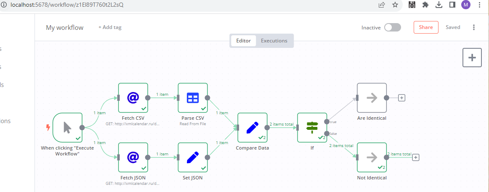

Workflow Description:

- **Manual Trigger**:
  - The workflow starts with a manual trigger, allowing you to initiate the execution directly from the n8n editor.

- **Fetch CSV**:
  - Makes an HTTP GET request to "http://xmlcalendar.ru/data/ru/2022/calendar.csv".
  - Retrieves the calendar data in CSV format as binary data.

- **Fetch JSON**:
  - Makes an HTTP GET request to "http://xmlcalendar.ru/data/ru/2022/calendar.json".
  - Retrieves the calendar data in JSON format as a string.

- **Parse CSV**:
  - Takes the binary data from the "Fetch CSV" node.
  - Parses the CSV data and converts it into a JSON object.

- **Set JSON**:
  - Reads the JSON string fetched from the "Fetch JSON" node.
  - Converts the string into a JSON object.

- **Compare Data**:
  - Compares the JSON representation of the parsed CSV data with the fetched JSON data.
  - Outputs a boolean value indicating whether the datasets are identical or not.

- **If Node**:
  - Evaluates the comparison result from the "Compare Data" node.
  - Routes the workflow to one of two outcomes:
    - "Are Identical" if the datasets match.
    - "Not Identical" if they don't.

- **Are Identical**:
  - A placeholder node indicating that the CSV and JSON data sources are identical.

- **Not Identical**:
  - A placeholder node indicating that the CSV and JSON data sources are not identical.

This workflow essentially fetches calendar data from two sources (CSV and JSON), processes the data, compares them, and then routes to an outcome based on the comparison result.

Try using the link to import the workflow:

https://gist.githubusercontent.com/MLegkovskis/c51b1c6da1aa920663c8218c8f40a898/raw/e674e5c7b7b4086570728b298761f4e3c92ad2c3/n8n-hw.json

If it does not work - use the .json file import.

